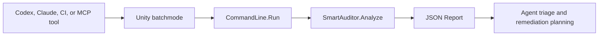

# Agentic Analysis

Agentic analysis is a workflow where a coding agent, CI assistant, or MCP server asks Smart Auditor to run its normal
deterministic analysis, then reads the exported report and performs higher-level reasoning over the results.

Smart Auditor should remain the source of truth for detection. Agents should use the report to triage, explain,
prioritize, and plan remediation.

## Recommended workflow

1. The agent launches Unity in batch mode.
2. Unity runs `SmartAuditor.Editor.CommandLine.Run`.
3. Smart Auditor writes a JSON report to the requested path.
4. The agent reads the report.
5. The agent groups findings by descriptor, category, path, assembly, scene, severity, and impact.
6. The agent produces a prioritized summary and, when requested, proposes or applies fixes.



## Command-line entry point

Use Unity's `-executeMethod SmartAuditor.Editor.CommandLine.Run` to run Smart Auditor from automation and agents.
For invocation examples, argument reference, defaults, targeted scope examples, and CI exit-code behavior, see
[Command-Line Analysis](CommandLine.md).

## Open-editor agent bridge

When the Unity project is already open, agents should use the file-based editor bridge instead of launching a second
Unity process. Enable it from **Preferences > Analysis > Smart Auditor > Agent Bridge > Enable Agent Bridge**.
Use **Open Agent Bridge Folder** in the same section to open the request/response directory.

The bridge watches:

```text
<Project>/Temp/SmartAuditorAgent/requests
```

Agents write requests as `request-id.request.json.tmp`, then atomically rename them to `request-id.request.json`.
Unity writes responses to:

```text
<Project>/Temp/SmartAuditorAgent/responses/request-id.response.json
```

If no `reportPath` is supplied, reports are written to:

```text
<Project>/Temp/SmartAuditorAgent/reports/request-id.report.json
```

Minimal request:

```json
{
  "id": "request-001",
  "action": "analyze",
  "scope": ["Code"],
  "assemblies": ["Assembly-CSharp"],
  "codeContext": "Runtime",
  "exportContentMode": "IssuesOnly"
}
```

The bridge processes requests one at a time, archives processed requests, and never overwrites an existing response.
It supports two actions: `analyze` and `ping`. Fixes remain out of scope for the initial agent workflow.

### Request fields

Every request must include `id` and `action`. For `analyze`, the bridge accepts the same scope surface as the
command-line entry point; see [Command-Line Analysis](CommandLine.md) for argument semantics.

| Field | Type | Notes |
|-------|------|-------|
| `id` | string | Letters, digits, `.`, `_`, or `-`. Must match the request file name. |
| `action` | string | `analyze` or `ping`. |
| `scope` | string[] | `Code`, `ProjectSettings`, `Assets`, `Prefabs`, `Shaders`, `Build`, or `All`. Ignored when `categories` is set. |
| `categories` | string[] | Category enum names or stable keys. |
| `platform` | string | Build target, e.g. `Android`. Defaults to the active build target. |
| `codeContext` | string | `Runtime`, `Editor`, or `All`. |
| `assemblies` | string[] | Assemblies to include in code analysis. |
| `assetPaths` | string[] | Exact asset paths. |
| `assetPathPrefixes` | string[] | Asset path prefixes. |
| `analysisSource` | string | `Assets` or `LoadedScene`. |
| `scenePath` | string | Required when `analysisSource` is `LoadedScene`. |
| `hierarchyPaths` | string[] | Loaded-scene hierarchy roots. |
| `analyzeReadOnlyPackages` | bool | Defaults to `false`. |
| `prettyPrint` | bool | Defaults to `true`. |
| `debugReport` | bool | Defaults to `false`. |
| `exportContentMode` | string | `Full`, `IssuesOnly`, or `IssuesPlusSummary`. Defaults to `IssuesOnly`. Pick `Full` when `insights` or `moduleMetadata` are needed. |
| `failOnIssues` | bool | Surfaces in the response status; the bridge does not exit a process. |
| `minSaveSeverity` | string | `Default`, `Error`, `Critical`, `Major`, `Moderate`, or `Minor`. Drops items below this severity from the saved JSON. `Default` disables filtering for the run; omit to inherit **Project Settings &gt; Smart Auditor &gt; Report Filter**. The MCP wrapper surfaces this as `min_save_severity`. |
| `reportPath` | string | Optional report path. Defaults to `<bridge>/reports/<id>.report.json`. |

### Response fields

| Field | Type | Notes |
|-------|------|-------|
| `schema` | int | Bridge response schema version. Increments on breaking changes; additions are non-breaking. |
| `id` | string | Echoes the request id. |
| `status` | string | `ok` (ping), `completed`, `failed`, or `rejected`. |
| `reportPath` | string | Set on `completed`. Absolute path to the JSON report. |
| `issueCount`, `issuesByCategory`, `issuesBySeverity` | numbers | Set on `completed`. |
| `error.type`, `error.message` | strings | Set on `failed` or `rejected`. |
| `startedAt`, `completedAt`, `durationMs` | timing | Always set. |
| `unityLogPath` | string | Path to the active Unity Editor log. |

Pin against the `schema` integer rather than the field set; future versions will keep the same integer when adding
non-breaking fields and will bump it when removing fields or changing semantics. The report file itself carries a
separate `version` string (currently `0.4.3`) for the report format.

### Ping action

`ping` answers "is the bridge alive?" without running an analysis. Pings jump the queue: a ping submitted while an
analyze is queued or while the editor is compiling, updating, or in playmode is processed immediately. Use this to
fail fast when Unity is not running, distinguish a closed editor from a slow analysis, and discover the bridge's
versioning surface.

Request:

```json
{ "id": "ping-001", "action": "ping" }
```

Response (additional fields beyond the standard set above):

| Field | Type | Notes |
|-------|------|-------|
| `smartAuditorVersion` | string | Installed Smart Auditor package version. |
| `reportSchema` | string | Report format version this bridge will produce. |
| `unityVersion` | string | Unity Editor version. |
| `projectPath` | string | Absolute project path. |
| `editorBusy` | bool | `true` while Unity is compiling, updating, or in playmode. The bridge still responded; subsequent analyzes will wait. |

## Targeted analysis

Agents should use the narrowest analysis scope that can answer the user's question. This keeps iteration quick and makes
the resulting report easier to reason about.

Prefer broad scope for first-pass discovery, then narrow by category, assembly, path, or scene context in follow-up
runs. For concrete flag combinations and command-line examples, see [Command-Line Analysis](CommandLine.md).

Scoped analysis is especially useful for follow-up turns. After an initial full report identifies a problem in
`Assets/UI`, the next agent run can target that folder instead of re-analyzing the whole project.

## Report consumption

The JSON report contains the data an agent needs to reason about the project:

| Field | Purpose |
|-------|---------|
| `issues` | Actionable diagnostics reported by Smart Auditor. |
| `messages` | Compiler, shader compiler, and asset import diagnostics. Present as an array in every JSON export mode, even when empty. |
| `insights` | Informational data tables, such as asset, build, assembly, or shader information. |
| `descriptors` | Diagnostic descriptions, impacts, recommendations, and documentation links for reported issues. Debug reports include the full descriptor catalog. |
| `sessionInfo` | Analysis target, project metadata, Unity version, and Smart Auditor version. |
| `moduleMetadata` | Modules that ran, their categories, timings, and result state. Debug reports also include UI layout metadata. |

Every issue includes:

| Issue field | Purpose |
|-------------|---------|
| `id` | Descriptor identifier, such as `MAT0001`. Useful for grouping by rule. |
| `fingerprint` | Stable issue key for matching the same finding across repeated reports. |
| `fingerprintStability` | Qualitative signal for how stable the key is: `Strong`, `Good`, `Medium`, or `Weak`. |
| `fingerprintParts` | Human-readable inputs used to generate the fingerprint, such as descriptor id, category, asset GUID, path, message arguments, custom properties, and location fallback. |

Agents should use `fingerprint` as the primary key when diffing reports across iterations. `id` and `path` are useful
for grouping and display, but they are not unique enough on their own. A location line, and when available a column,
may be part of the fingerprint when Smart Auditor has no stronger analyzer-specific context, but Smart Auditor does not hash offending source text; code
edits can otherwise make the same finding appear unrelated.

Messages also include `fingerprint` and `fingerprintStability` so agents can diff compiler/import diagnostics across
iterations. Messages do not require descriptor entries; use `source`, `category`, `severity`, `code`, `message`, and
`location` to group and present them.

Agents should cite issue IDs, fingerprints, file paths, descriptor recommendations, and report metadata when making conclusions.
When an agent infers a root cause, it should distinguish that inference from deterministic Smart Auditor findings.

## Suggested agent behavior

Good agentic analysis usually follows this order:

1. Summarize the highest-severity issues.
2. Cluster related findings by root cause.
3. Identify low-risk fixes that can be applied mechanically.
4. Identify changes that need profiling, visual QA, playtesting, or human review.
5. Produce a short remediation plan.
6. Apply fixes only when explicitly requested by the user or calling workflow.

Examples of useful agent outputs:

* "Most texture warnings are Android import override problems in `Assets/UI`."
* "Three code issues happen in runtime assemblies and affect allocation-sensitive update paths."
* "The build report suggests duplicated Addressables content is a larger risk than the individual texture warnings."

## Guardrails

Agents should not silently modify assets, project settings, or code. A safe integration treats Smart Auditor analysis as
read-only unless a human or CI workflow explicitly requests fixes.

When fixes are requested, apply small reviewable batches with explicit human or CI approval. Code edits should include
source references and preserve the original report as evidence.

## MCP and tool wrappers

An MCP server or local agent tool can expose a small wrapper around the Unity command:

```json
{
  "tool": "run_smart_auditor",
  "args": {
    "projectPath": "/path/to/UnityProject",
    "reportPath": "/tmp/smart-auditor-report.json",
    "scope": ["Code"],
    "assemblies": ["Assembly-CSharp"],
    "codeContext": "Runtime"
  }
}
```

The wrapper should return:

* The Unity process exit code.
* The absolute report path.
* Standard output and error logs, or a path to the Unity log file.
* A compact count of issues by severity and category, if available.

The agent can then load the report and continue with triage or remediation.
